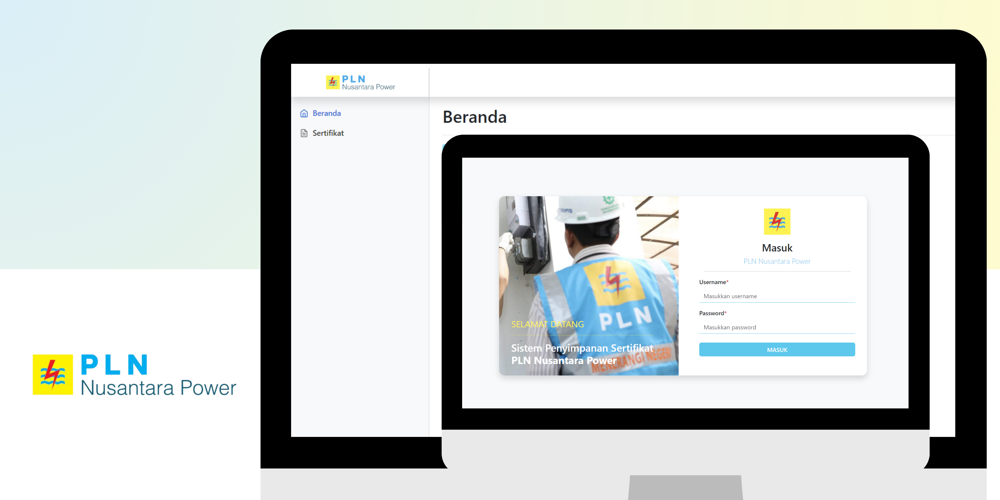

##

### SiPEKAT, Web Application for Storing Certificates at PLN Nusantara Power

## 📙 Description

SiPEKAT is a web-based application designed to facilitate data collection and management of certificate archives issued by PT. PLN Nusantara Power Pekanbaru. The application provides a secure and structured digital platform for quickly storing, searching and accessing certificate archives, replacing less efficient manual methods. With SiPEKAT, each certificate can be recorded and organized in detail, allowing users to track certificate history and manage information more transparently and securely. This application supports the efficiency and accuracy of data collection, making the audit and reporting process easier at PT. PLN Nusantara Power Pekanbaru.

## 📖 Features

Interesting features of SiPEKAT:

1. **Authentication** : Admins can log in to the application via a registered account.

2. **Dashboard Admin** : Displays visualization of data on the website.

3. **CRUD Data** : Can add, view, change, search and delete certificate data issued by PT. PLN Nusantara Power Pekanbaru.
